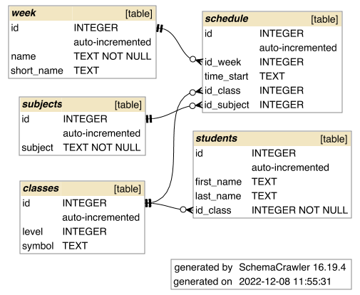
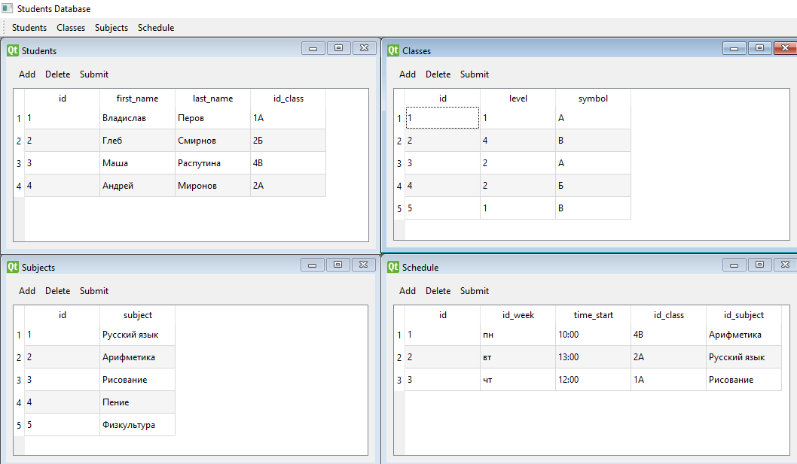
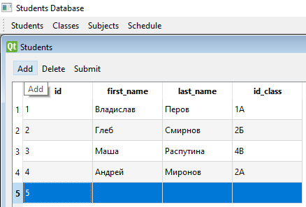
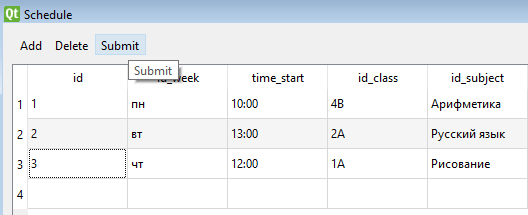
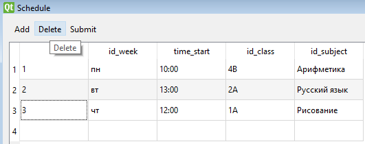
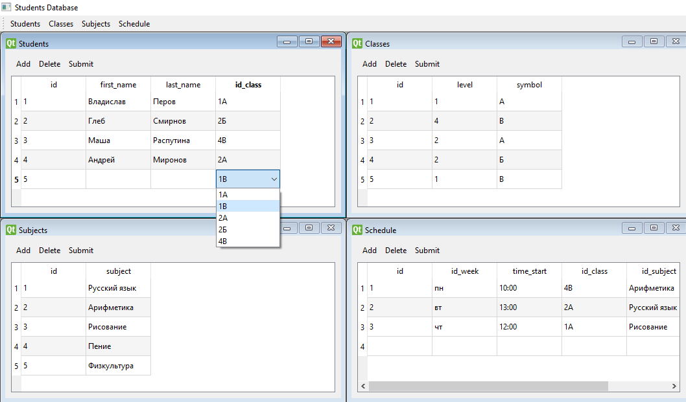
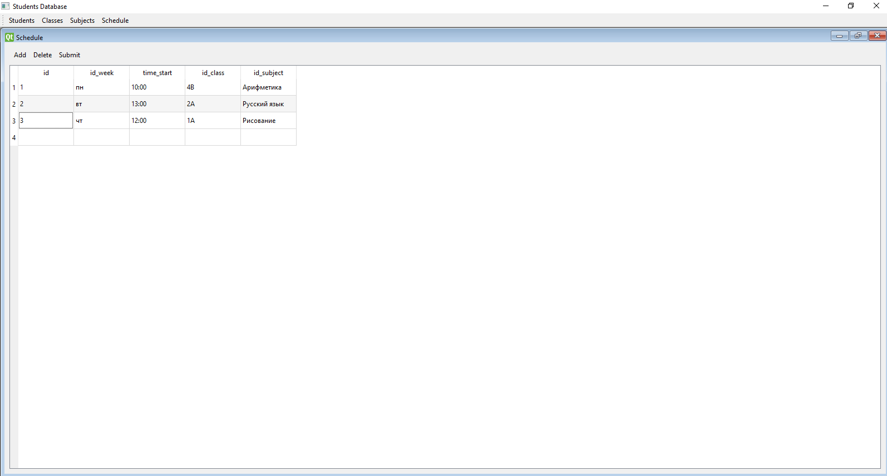
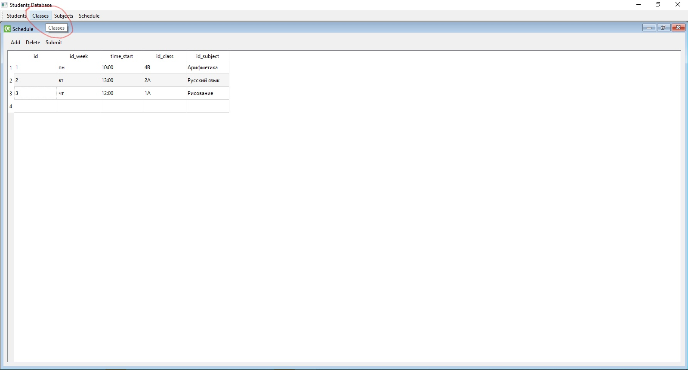

# Информационная система "Алиса"

## Структура базы данных

## База данных состоит из четырёх основных таблиц

* ### Students 
  * id (_Идентификационный номер записи_)
  * first_name (_Имя_)
  * last_name (_Фамилия_)
  * id_class (_Класс_)
* ### Classes 
  * id (_Идентификационный номер записи_)
  * level (_Класс_)
  * symbol (_Буква_)
* ### Subjects
  * id (_Идентификационный номер записи_)
  * subject (_Название урока_)
* ### Schedule
  * id (_Идентификационный номер записи_)
  * id_week (_День недели_)
  * time_start (_Время начала урока_)
  * id_class (_Класс_)
  * id_subject (_Урок_)
____

## Работа с информационной системой
В таблицах реализованы следующие операции:
* Добавление новых записей
  * Начало добавления:
  
    

  * После добавления для записи новых строк в базу данных необходимо нажать кнопку `Submit`:
  
    

* Удаление записей.  

* Редактирование существующих записей. При редактировании ссылочных полей для пользователя отображается выпадающий 
  выпадающий список с читаемыми именами, при этом все поля хранятся и записываются в виде ключей.  

* Каждая таблица представлены в виде отдельного окна приложения, можно изменять её размеры и разворачивать на
  полный экран  

* При этом остаётся возможность переключения между таблицами

____

## Над проектом работали:

* ### Рафаэль: _**Создание и первичное заполнение базы данных, чтение и изменение записей**_
* ### Александр: _**Графический интерфейс**_
* ### Алексей: _**Добавление и удаление записей, инструкция**_
* ### Артём: _**Git-репозиторий, добавление и удаление записей**_
