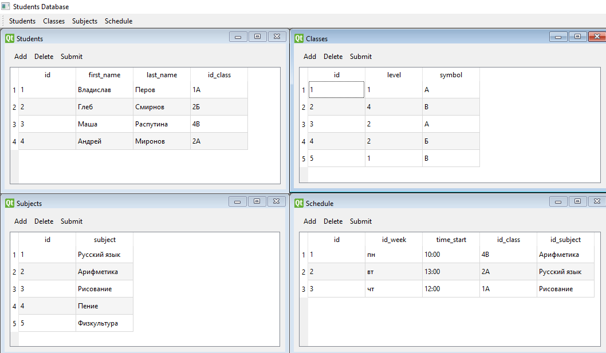

# Группа №3
## Информационная система "Алиса"
### Структура базаы данных

### База данных состоит из четырёх таблиц

* ###Students 
  * id (_Идентификационный номер записи_)
  * first_name (_Имя учащегося_)
  * last_name()
  * id_class()
* ###Classes ####()
  * id (_Идентификационный номер записи_)
  * level (_Класс_)
  * symbol (_Буква_)
* ###Subjects
  * id (_Идентификационный номер записи_)
  * Subject (_Название урока_)
* ###Schedule
  * id (_Идентификационный номер записи_)
  * id_week (_День недели_)
  * time_start (_Время начала урока_)
  * id_class (_Класс_)
  * id_subject (_Название урока_)
____
##Работа с информационной системой
В каждой таблице реализована возможность :
* Добавление
  *  

* Удаление
  * 

* Редактирование
  * 

Каждой таблицей поддерживается полноэкранный режим

При этом остаётся возможность переключения между таблицами

Все пересекающиеся поля таблиц являются ссылочными и сделаны выпадающими списками

